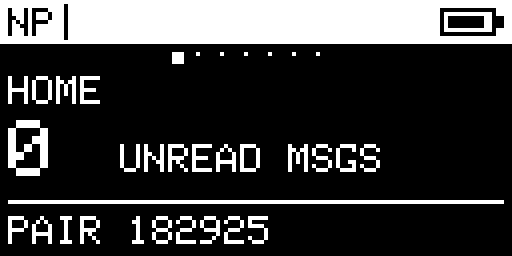
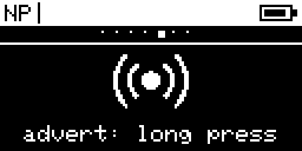
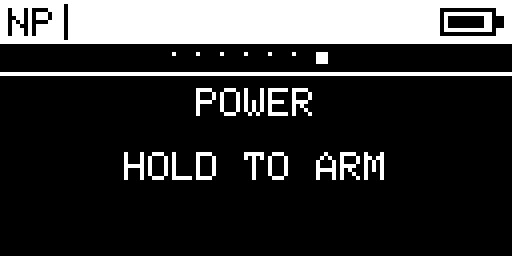

  

# NeonPocketMC for Heltec V3

Experimental MeshCore BLE or native-USB companion firmware for the **Heltec WiFi LoRa 32 V3 with its integrated 128×64 SSD1306 OLED and SX1262**.

> [!WARNING]
> **Heltec V3 only. Do not flash this on Heltec V4, RCC6, RC52, Wireless Tracker, or a board with different display/radio hardware.** This repository ships separate BLE and native-USB companion images—no Wi-Fi, repeater, or room-server firmware.

**Guided install:** [flasher.canadaverse.org](https://flasher.canadaverse.org/)

## What is included

- MeshCore 1.17.1 receive-gain fix line, based on exact upstream commit `727fc0512ce08bfd7b499e46daa7fca6eeec730d`.
- Native Heltec V3 radio wiring and power control from upstream MeshCore: SX1262, DIO2 RF switch, 1.8 V DIO3 TCXO, active-low Vext, and the integrated OLED.
- A smooth procedural NeonPocket startup, compact phone-like Home dashboard, Inbox, Nearby, Radio, Bluetooth, Advert, and confirmed Power pages.
- 350 contacts, 40 channels, and 256 pending companion frames.
- 60-second OLED timeout while BLE and LoRa continue running.
- Fail-closed storage mounting. Existing identity, contacts, channels, and preferences are not silently formatted after a mount error.

## Button controls

- Screen off: the first gesture only wakes the OLED.
- Single press: next page or next Inbox message.
- Double press: current-page action; on Home it opens Inbox.
- Triple press: return to Home; from Inbox it also clears every local unread message.
- Hold: show Power confirmation.
- Hold again within eight seconds while confirmation is visible: hibernate after release.
- During the first eight seconds after boot, hold enters MeshCore CLI Rescue.

## Install

Download the current experimental [`v1.0.0-rc.4` release](https://github.com/n30nex/NeonPocketMC-Heltec-V3/releases/tag/v1.0.0-rc.4).

- Normal update: flash `NeonPocketMC-Heltec-V3-BLE-app.bin` at offset `0x10000`.
- Wired companion: flash `NeonPocketMC-Heltec-V3-USB-app.bin` at offset `0x10000`.
- BLE recovery: flash `NeonPocketMC-Heltec-V3-BLE-recovery-preserves-settings.bin` at offset `0x0`.
- USB recovery: flash `NeonPocketMC-Heltec-V3-USB-recovery-preserves-settings.bin` at offset `0x0`.

The recovery image replaces boot/application metadata and clears ESP32 NVS state such as old BLE bonds, but does not extend into the SPIFFS data partition that holds MeshCore identity and preferences. Always verify the published SHA-256 manifest before flashing, attach a suitable antenna before transmitting, and use USB recovery if an experimental candidate fails to boot.

## Hardware gallery

These frames were captured directly from the qualification unit's SSD1306 framebuffer while the exact V3 candidate was running. They are hardware output, not rendered mockups.

  

| Home | Bluetooth |
|---|---|
|  |  |

| Advert | Power confirmation |
|---|---|
|  |  |

## Status

`v1.0.0-rc.4` is experimental. It keeps native USB and the triple-press Home/clear shortcut, and normalizes unsupported live-GPS advert settings to saved coordinates. Both companion targets are CI-qualified; no new physical V3 receipt is claimed for RC4.

## Upstream and licensing

This is a community project, not an official Heltec or MeshCore release. It is derived from [meshcore-dev/MeshCore](https://github.com/meshcore-dev/MeshCore). Upstream and third-party license files remain in this source tree.
